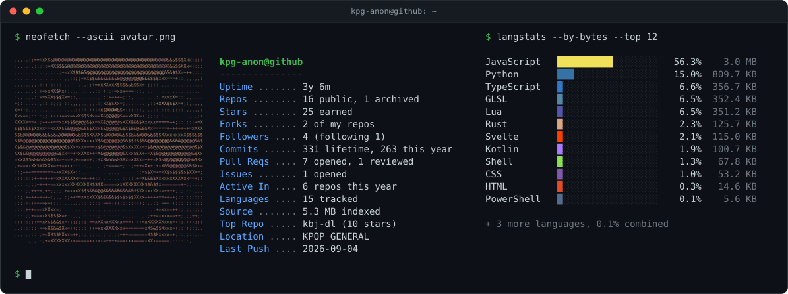

<picture>
  <source media="(prefers-color-scheme: dark)" srcset="dark_mode.svg">
  <source media="(prefers-color-scheme: light)" srcset="light_mode.svg">
  
</picture>

<!--
The card above is generated by generate.py and refreshed daily by
.github/workflows/update-card.yml. To rebuild it locally:

    pip install -r requirements.txt
    GH_TOKEN="$(gh auth token)" python generate.py --user kpg-anon

Numbers cover public, non-fork repositories only.
-->
